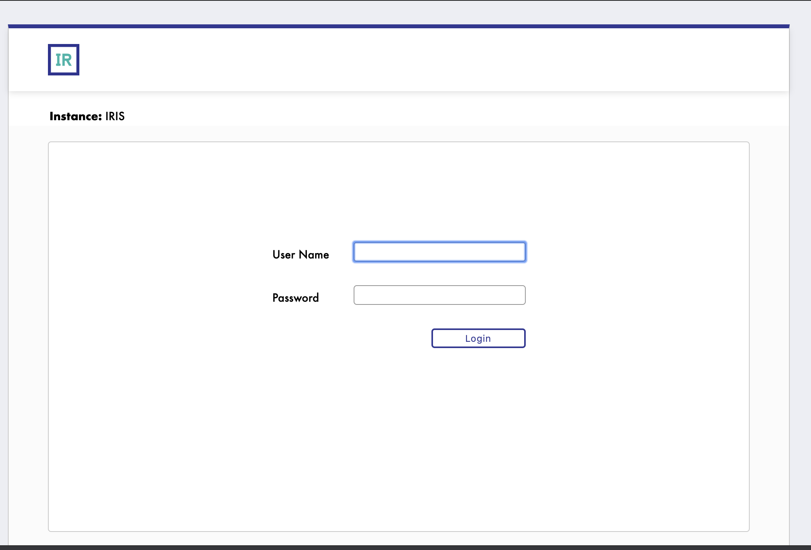

**Disclaimer**: *This is not production-ready. It is a simple proof of concept. Considerations such as graceful shutdowns, liveness/readiness probes, dynamic storage provisioning, and HA deployments have not been addressed*

This repo deploys the Intersystems IRIS Data Platform Community Edition found [here](https://hub.docker.com/_/intersystems-iris-data-platform/plans/222f869e-567c-4928-b572-eb6a29706fbd?tab=instructions)

The repo includes the Kubernetes & OpenShift resources (service account, pvc, service, deployment, route) required to deploy the Iris Data Platform on OpenShift. To generate the resources, a docker compose file was copied from [docker hub instructions](https://hub.docker.com/_/intersystems-iris-data-platform/plans/222f869e-567c-4928-b572-eb6a29706fbd?tab=instructions) to 'iris-compose.yaml' then using the following [kompose](https://kompose.io/) command,

```sh
kompose convert -f iris-compose.yaml
```
the following kubernetes resources were generated - PersistentVolumeClaim, Service, and Deployment.

The container as-is needs to run as a privileged container. By default, this is disallowed on OpenShift. To deploy on a cluster where the OpenShift user can run a privileged container, a new service account with the appropriate security context contraints should be created. The generated Kubernetes Deployment resource is updated to reference the new service account.

Finally, an OpenShift Route was created to allow external traffic to the IRIS Data Platform.

To deploy on OpenShift, run the following commands

```sh
./iris-service-account-final.sh
oc apply -f iris-claim0-persistentvolumeclaim-final.yaml 
oc apply -f iris-service-final.yaml
oc apply -f iris-route-final.yaml
oc apply -f iris-deployment-final.yaml
```

Note: If your cluster supports dynamic storage provisioning, you can skip the creation of the PersistentVolumeClaim and modify the Deployment resource volume spec.

To view the application, run the following command, 
```
IRIS_ROUTE=$(oc get route iris -o template  --template='{{ .spec.host }}')
echo http://$(echo $IRIS_ROUTE)/csp/sys/UtilHome.csp
```
grab the generated URL and paste in your favourite browser.

You should see this page



Login with

```
user:_SYSTEM 
password: SYS
```
After successful login, the application may ask you to change the password.

NOTE: if the page doesn't show, execute the following on the IRIS pod
```
oc exec [pod] -- iris session IRIS 
```