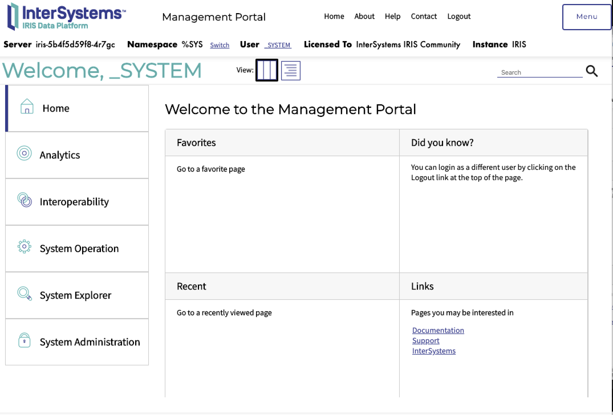

**Disclaimer**: *This is not production-grade or production-ready. It is a simple proof of concept. Considerations such as graceful shutdowns, liveness/readiness probes, appropriate storage options, HA deployments etc have not been addressed. Also, the container had to be run as privileged which is usually not advisable. The vendor should provide official instructions to install on OpenShift (via templates, Helm Charts, Operator or some other method)*

This repo deploys the Intersystems IRIS Data Platform Community Edition found [here](https://hub.docker.com/_/intersystems-iris-data-platform/plans/222f869e-567c-4928-b572-eb6a29706fbd?tab=instructions) on OpenShift, a certified Kubernetes platform

The repo includes the Kubernetes & OpenShift resources (service account, pvc, service, deployment, route) required to deploy the Iris Data Platform on OpenShift. To generate the resources, a docker compose file was copied from [docker hub instructions](https://hub.docker.com/_/intersystems-iris-data-platform/plans/222f869e-567c-4928-b572-eb6a29706fbd?tab=instructions) to 'iris-compose.yaml' then using the following [kompose](https://kompose.io/) command,


> ```kompose convert -f iris-compose.yaml```

the following kubernetes resources were generated - PersistentVolumeClaim, Service, and Deployment.

The container as-is needs to run as *a privileged container*. **By default, this is disallowed on OpenShift**. To deploy on a cluster where the OpenShift user can run a privileged container, a new service account with the appropriate security context contraints should be created. The generated Kubernetes Deployment resource is updated to reference the new service account.

Finally, an OpenShift Route was created to allow external traffic to the IRIS Data Platform.

To deploy on OpenShift, ensure you are logged into a cluster using the oc client and have created a new project

> ```oc new-project iris-data-platform```

Create the Service Account. This following command needs to be run by an admin-level user in OpenShift with the permissions to add the anyuidd security context constraint. 

> ```./iris-service-account-final.sh```

Once that is completed successfully **without errors**, you are now ready to install the software on OpenShift.

If using file storage, you can run the following command to install. This will create deployment with persistent storage

> ```oc apply -f config/ ```

However, if using a different storage class, you can create a deployment using ephemeral storage i.e. no persistence.

> ```oc apply -f config-ephemeral/ ```

To view the application, run the following command to retrieve the URL to the IRIS Data Platform Running on OpenShift

> ```IRIS_ROUTE=$(oc get route iris -o template  --template='{{ .spec.host }}')```

> ```echo http://$(echo $IRIS_ROUTE)/csp/sys/UtilHome.csp```

Copy the generated URL and paste in your favourite browser.

You should see this page


**NOTE**: if the login doesn't display, execute the following on the IRIS pod
> ```oc exec [pod] -- iris session IRIS ```

*TODO: add a post-start hook or readiness probe to ensure the session is up and running*

Login with

```
user:_SYSTEM 
password: SYS
```
After successful login, the application may ask you to change the password. 




